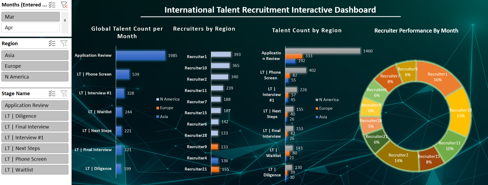
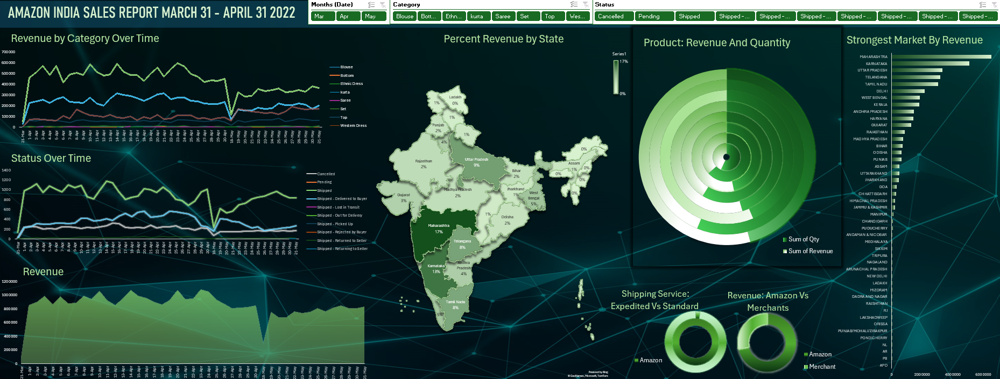
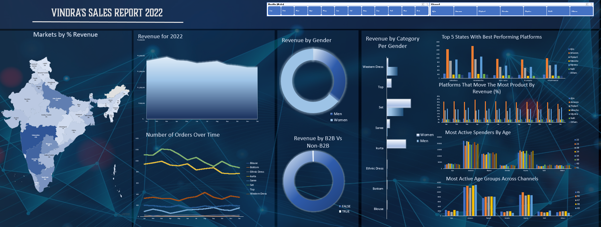

# Data Analytics Portfolio
# Project 1

**Title:** [International Recruitment Interactive Dashboard](https://github.com/cjlferguson/cjlferguson.github.io/blob/main/TalentRecruitProject.xlsx)

**Tools Used:** Microsoft Excel (Conditional Formatting, Pivot Tables, Pivot Charts, Filters, Sort, Slicers)

**Project Description:** The study analyses and provides the key metrics in the recruitment process for an International Recruitment Agency. It identifies trends and patterns in the recruitment process across different global regions for the months of March and April, 2022. 
The study focusses on three geographical areas of recruitment resource: North America, Europe, and Asia. The data set holds over seven thousand (7000) rows of data with information spread over three tables. 
The recruitment process has seven (7) active phases: Application Review, Phone Screening, Interview #1, Waitlist, Next Steps, Final Interview, Diligence. These phases are separated and analyzed through various Excel tools and curated via a Dashboard.
The dashboard includes the following:
1.	_Global Talent Count Per Month_. Visual representation of count number of applicants during each phase of the recruitment process.
2.	_Recruiters by Region_. Demonstrates the performance by numbers of recruiters for each region they are responsible for.
3.	_Talent Count by Region_. Highlights by numbers within the recruitment process the talent resource each region provides. 
4.	_Recruiter Performance by Month_. Provides the top 11 recruiters presenting their recruitment performance by percentage. 

Additionally, the dashboard includes several slicers for:

_Month_. To filter data for a specific month.

_Region_. Focus on regional areas regarding their place as a global talent resource for recruitment purposes.

_Stage Name_. To drill down into the performance of recruiters across regions and the performance of talent recruitment within each phase of the recruitment process.

**Key findings:** 
1.	The agency recruits talent from across three regions: North America (74%), Europe (18%), and Asia (8%). For the combined months of March and April this represented 3440 applications. 
2.	Average daily applications = 70. 
3.	No. of recruiters at agency = 56. The top 11 provides agency with over 70% of talent recruitment. This represents 19% of the agency that brings in 70% of talent recruitment over the combined period of March and April with only 80% contributing to the remaining 30% of applications.
4.	Talent recruitment for March was 1985 while for April 1455, a decrease by 27% from the previous month. 
5.	March 3-6 recorded the highest application intake for both months: March 6 at 346 applications, 334 on March 5, 121 on March 3, and 100 on March 4. Applications averaged 64 per day for the entire month when considered with this four day window of high intake. Excluding for March 3-6 average daily applications were reduced to 43 per day. For the month of April applications averaged at 49 per day.
6.	Commercial & Contract Law, Litigation, Investigations & Dispute Resolution, and Legal Support were overall the 3 major areas for talent recruitment. Further focus should be given to strengthening Bankruptcy & Reorganization, Corporate, Mergers and Acquisitions, Intellectual Property, Labor & Employment, Tax, and Finance. These were areas where regions were very strong at and could provide significant resource to recruitment from those talent fields.
7.	Recruiter numbers should be reduced by 66% which represents the number of recruiters who brought in 1% or less over the combined months of March and April.
8.	Members of the Top 11 recruiters should be better distributed. It was found that many of the top recruiters were in one team. The human resource could be better managed by distributing members equally among regional teams which would improve agency efficiency and goals in the various regions of talent acquisitions. 

**Drill Down:**

Analysis of Recruiters

1.	There are 56 recruiters working at the agency. Of the 56, 11 provides the agency with its entire application listing, a total of 2533 applications for both the months of March and April. These have contributed to the listing with a performance of no lower than 5%. Of the 11 recruiters, 16% of the recruitment belonged to Recruiter 1, 15% by Recruiter 10, 14% by Recruiter 2, and 10% is made by Recruiter 11 for the month of March. Collectively, these 4 recruiters account for 55% of recruitments for the months of March.
2.	For the month of April, Recruiter 1’s performance decreased to 13%, Recruiter 10’s was at 9%, Recruiter 2 increased to 16%, Recruiter 11 improved to 15%. 
3.	Other recruiters improved during that month with Recruiter 15 moving from 8% to 11%, and Recruiter 6 improving from 6% to 10%. 
4.	For the month of April, recruiters 1, 2, 11, 15 and 5 brought in 65% of international talent. Despite this, April saw a 27% decline in applications.
5.	However, these may not be considered a true measure of performance as it is the percentage in relation to the grand total of the 11 top recruiters for a specific month. Given that a grand total may change among the 11, if there is reduction in the grand total but improvement in numbers for a particular recruiter, the resulting percentage could be a significant increase. Or if the opposite occurs with a reduction in applications for a particular recruiter but an overall increase in the grand total, the percentage change can be significant. Measurement in this way skews the true performance measure of the individual. However, this measure does give a good idea of the performance of the recruiters over the month. This measure may fit well with group targets and measurements overall, since it is dependent on the performance of the group’s overall performance.
6.	Recruiter’s 15 and 7 may have been due to the reduction of applications within that month. For instance, Recruiter 7’s numeric performance for March and April were 63 and 23 respectively. This is a marked decrease by 40 applications; over half of Recruiter 7’s performance for March was eroded in April. If in March, the numerator is further away from the denominator (the total number of applications for March) compared to April where the numerator is closer to the denominator then from the perspective of percentages Recruiter 7’s performance can easily be seen as an increase. Therefore, the agency’s overall poor performance for April may have masked Recruiter’s 7 and also 15 and therefore may be regarded as not a true performance measure for that month. Nevertheless, as was noted earlier, the percentage measures by month within the grand total of the group still provides a good idea of performance. This measure may fit well with group targets and measurements overall, since it is dependent on the performance of the group’s overall performance.

Regional Analysis

1.	The total talent recruited for March was 1985 applications while for April 1455: a grand total of 3440 talent applications.
2.	Talent is recruited across three global regions with North America significantly providing most of the talent resources at 1460 applicants in March and 1073 for the month of April; Europe coming in second with 333 March applicants compared to its April 289 applicants; and Asia last with 192 compared to 93. 
3.	Combined Months: The three (3) major talent areas for applications provided by the regions were Commercial & Contract Law (30%), Litigation, Investigations & Dispute Resolution (13%), and Legal Support (8%). 
4.	Combined Months: North America led in Commercial & Contract Law at 66%, Europe 25%, and Asia at 9%.  Litigation, Investigations & Dispute Resolution with North America at 83%, Europe at 10%, and Asia at 6%. Legal Support saw North America leading by 76%, Europe 19%, and Asia 5%.
5.	Combined Months: Asia showed significant talent strength in Bankruptcy & Reorganization (21%; Europe was at a considerable low of 7%), Corporate (10%), Mergers and Acquisitions (17%). 
6.	Combined Months: North America was strongest in Intellectual Property (89%) and Labor & Employment, and Tax (88%) respectively. Europe showed great strength in Commercial & Contract Law and Mergers & Acquisitions (25%) respectively, and Finance.
7.	The month of April saw a decline in applications by 530 from application numbers held in March. As noted in Asia’s performance was incredibly poor with over half of its applications being lost in the month of April compared to the month of March.
8.	This reduction in talent recruitment was largely contributed by the reduction in North American applications by 387. This was a 27% reduction from North America while Europe and Asia observed a drop by 13% and 51% respectively.
9.	While it was observed that Asia had the highest drop of talent applications by percentage, this region for the two months contributed only 8% to the grand total of talent applications, with Europe providing 18% in recruitment power and the majority recruitment occurring from the North American region for 74% for the two months. 
10.	The agency has retained 37 recruiters for the North American region. Within this group there 8 of the 11 top recruiters are in this group: they are recruiters 1, 2, 6, 7, 10, 11, 15, 16. These alone accounts for 85% of the entire agency’s recruitment portfolio.
11.	7 recruiters are retained for Asia: only 1 from the top 11 are in this group: Recruiter 21 holds 4% of the entire agency’s portfolio in regards to Asia.
12.	There are 12 recruiters to Europe. 2 of the 11 top recruiters are in this group. Recruiters 9 and 12 hold 11% of the agency’s portfolio to Europe.

Talent Recruitment Process: Application to 1st Interview to Recruitment

1.	March 3-6 recorded a significant increase in applications with the highest for both months recorded at March 6 at 346 applications, 334 on March 5, 121 on March 3, and 100 on March 4. Applications averaged 64 per day for the entire month when considered with this four day window of high intake. Excluding the March 3-6 window, average applications were reduced to 43 per day. For the month of April applications averaged at 49 per day.
2.	Talent in Commercial & Contract Law was the highest for March and April at 581 (29%) and 463 (32%) respectively. Litigation, Investigations and Dispute Resolution were at 265 (13%) and 193 (13%) for both March and April, and Regulatory & Compliance at 167 (8%) and 93 (6%) for the respective months.
3.	For the month of March only 328 individuals were accepted for the first interview, which was 17% of the original sum of applicants, 1985, and 83% rejection rate for that month. April saw 361 interviews or 25% interviews of the original applicants of 1455, and 75% rejection rate for that month.
4.	At the first interview Commercial & Contract Law remained highest at 122 (37%) and 144 (40%) for March and April respectively. However, Finance was second at 47 (14%) and 35 (10%) respectively, and Legal Support at 47 (14%) and 25 (10%) respectively.
5.	Combined Months: Recruitment: The talent recruitment was highest in these areas: Commercial and Contract Law (39%), Legal Support (15%), Finance (14%).
6.	Combined Months: Recruitment: Asia demonstrated strength in Bankruptcy & Reorganization supplying 50% of talent along with North America, and 50% of talent with North America in Insurance. In both cases Europe’s talent contribution was 0%.

**Recommendations:**
1.	Improving Agency Efficiency. Given that 80% of the agency’s talent recruitment is made by 20% of it’s recruiters, the agency must consider where its human resource strength lies. It is suggested that to increase efficiency at the agency, recruiter numbers should be reduced by 66%. This represents the number of recruiters who brought in 1% or less over the combined months of March and April. This approach would free up further resources which could be invested into strengthening the remaining recruiters with training, access to better tools, and improvement in marketing.
2.	Restructuring and Training. 7 of the Top 11 recruiters were retained in the North American Team. This team should be redistributed along with the remaining 3 members according to application market size over the three regions so that the agency’s strength is better leveraged across the talent recruitment markets. The remaining 8 recruiters should be provided with further training to improve both overall team and specific member capacity to compliment the agency’s goals. Lessons learned and strategies practiced by the top three performing members should be leveraged with the overall knowledge pool of this new group. 
3.	Focus on Key Talent Areas. Commercial & Contract Law, Litigation, Investigations & Dispute Resolution, and Legal Support were overall the 3 major areas for talent recruitment. However the Asian community was competitive in Bankruptcy & Reorganization, Corporate, Mergers and Acquisitions. North America was strongest in Intellectual Property, Labor & Employment, and Tax respectively. Europe showed great strength in Commercial & Contract Law, Mergers & Acquisitions, and Finance. These are areas which could be given future consideration. It may further aid agency goals if recruiters were to specialize in talent recruitment in these areas which may strengthen numbers where market recruitment is low particularly in Asian and some of the European talent areas. 

**Dashboard Overview:**

# Project 2

**Title:** [Amazon Sales Report India](https://github.com/cjlferguson/cjlferguson.github.io/blob/main/AmazonSalesReport.xlsx) 

**Tools Used:** Microsoft Excel (Conditional Formatting, Pivot Tables, Pivot Charts, Filters, Excel Maps, Sort, Slicers)

**Project Description:** The report analyses key sales trends on the Amazon platform, India, for the months March, April, and May for the year 2022. 
The data set contains 24 columns and 65,536 rows. 
The data was analyzed through various Excel tools and curated via a Dashboard.
The dashboard includes the following:
1.	Revenue by Category Over Time. A line graph providing a comparative perspective of the contribution each category of products made to revenue relative to one another, over time.
2.	Status Over Time. A line graph providing a visual of the trends of delivery status over time. This includes Cancellations, Deliveries, and Shippings.
3.	Revenue. A line graph providing perspective on revenue trend over time.
4.	Percent Revenue By State. A map visual providing perspective of revenue each state contributes by sale relative to the other. The state is colour graded with darker colours indicating greater revenue vs lighter colours indicating smaller revenue earned.
5.	Product: Revenue and Quantity. A circular bar chart providing a comparative view of the number of products sold relative to the revenue earned through its sale.
6.	Shipping Service: Expedited vs Standard. A pie chart providing a visual regarding  which shipping service is preferred by customers of combined merchants of India vs Amazon India  customers. 
7.	Market Dominance: Amazon Vs Merchants. A pie chart visual regarding market dominance by revenue of Amazon India vs other merchants.
8.	Strongest Market By Revenue. A vertical bar chart indicating the state which contributes the largest revenue by sales to Amazon India. This provides a compliment to the ‘Percent Revenue by State’ map in (4.).

Additionally, the dashboard includes several slicers for:

_Month_. The data covers only three months. It is therefore reasonable and creates ease to filter data by a specific month.

_Category_. Category stands for Category of Products. It is imperative to analyze the data through the perspective of products and its sales impact over time.

_Status_. Status stands for status on the product. This regards whether it has been delivered, shipped, pending, etc. 

**Key findings:**

1.	The entire market given through products is dominated by Amazon, 72%, of market share and Merchants, 28%.
2.	The daily average excluding May 18 was ₹440558. On May 18, a contraction in sales by -26%. This means that every ₹1 made on Sets for May 18 led was 1.74 times less than daily average revenue. It was also observed that for every ₹1 earned, a loss of ₹2.82 occurred relative to the daily average revenue earned through sales of Sets.
3.	Shipped (Only) under Status also showed the greatest contraction for May 18 among all Status by 72%. Daily revenue by Shipping (Only) Status was ₹ 575026.70. A loss of ₹415291.70 was made that day with earnings of only ₹159735. This means that for every ₹1 earned, a loss of ₹2.60 relative to the average daily revenue through Shipping (only) was made.
4.	Out of all 61240 customers the top 5000 customers contributed 21% of the revenues earned. Any reduction in spending by these customers would cause a significant contraction in revenue as seen on May 18 leading to the recorded loss on that day.

**Drill Down:**

Revenue

1.	On May 18-19, 2022 India Amazon and Merchant platforms observed a significant contraction in revenues which saw a loss of 68% in total revenue. The maximum revenue for that period was ₹1076427.
2.	Sets were the greatest selling product with a revenue of ₹19499857 at the end of the period and contributing 51% of the entire revenue derived by the sale of products. The contraction of sales by a percentage difference from May 17 to May 18 by -2% led to significant loss in revenues. 
3.	The daily average excluding May 18 was ₹440558. On May 18, a contraction in sales by -26%. This means that every ₹1 made on Sets for May 18 led was 1.74 times less than daily average revenue. It was also observed that for every ₹1 earned, a loss of ₹2.82 occurred relative to the daily average revenue earned through sales of Sets.
4.	Shipped (Only) under Status also showed the greatest contraction for May 18 among all Status by 72%. Daily revenue by Shipping (Only) Status was ₹ 575026.70. A loss of ₹415291.70 was made that day with earnings of only ₹159735. This means that for every ₹1 earned, a loss of ₹2.60 relative to the average daily revenue secured through Shipping (Only) was made.
5.	It was found that for a normal day the average revenue as a result of shipping was 3.6 times higher than that earned on May 18. 
6.	Out of all 61240 customers, the top 5000 customers contributed 21% of the revenues earned. Any reduction in spending by these customers would cause a significant contraction in revenue on May 18 leading to the recorded loss on that day.

Markets and Revenue

1.	The entire market given through products is dominated by Amazon and Merchants. There are 8 products that enable market analysis of the two entities. Amazon retains 72% of market share and Merchants, 28%.
2.	There are 47 states that provide the total market value for Amazon and Non Amazon sellers, or Merchants.
3.	The top 5 markets by state from greatest to least are Maharashtra (Amazon 73%; Merchants 27%), Karnataka (Amazon 76%; Merchants 24%), Uttar Pradesh (Amazon 70%; Merchants 30%), Telangana (Amazon 73%; Merchants 27%), and Tamil Nadu (Amazon 74%; Merchants 26%). Merchants have a higher market share at 30% in Uttar Pradesh compared to the other 4 states. 
4.	Maharashtra was the strongest market by revenue while PB was the weakest.
5.	Pondicherry, NL, AR, PB, and Apo were the bottom 5 markets from strongest to weakest. It appears that there is no Amazon or Merchant presence in Apo.
6.	Apart from Apo, there are no Merchant presence in the remaining 4 states. Amazon is the soul presence that dominates 100% of the market. Despite this sales remained very low. 
7.	Most of the markets Amazon has been the dominant competitor. Lakshadweep, Orissa, Punjab/Mohali/Zirakpur, and RJ had 100% market share retained by Merchants. These 4 states did not have an Amazon presence. 
8.	Aruncal Pradesh and Punjab had Merchant market share of 37%, and Sikkim retaining the highest Merchant market share of 40%. While Amazon still dominates most of the market share in these three states, it should be noted that the Merchants within these markets have demonstrated the strongest competitiveness against Amazon.

Products and Sale

1.	The three most popular products by revenue were Sets (51%), Kurtas (27%) and Western Dress (13%).
2.	Sets were the highest selling product accounting for 51% of revenue with Amazon retaining 73% of revenues derived from sales of this product and Merchants, 27%.

**Dashboard Overview:**

# Project 3

**Title:** [Vindra's Sales Report](https://github.com/cjlferguson/cjlferguson.github.io/blob/main/VindrasSalesReport.xlsx)

**Tools Used:** Microsoft Excel (Conditional Formatting, Pivot Tables, Pivot Charts, Filters, Excel Maps, Sort, Slicers)

**Project Description:**Vindra is a clothing store with products across several platforms. The report concerns several issues. Store observed a decline in sales over the course of 2022 and it is important to address this and possibly suggest what could be done to overcome the issue moving into 2023. As such questions regarding the biggest platform users, which platforms are the best, which states are Vindra’s greatest markets, and the impact of gender on sales are asked and reported on.
The data set contains 20 columns and 31,048 rows. The columns are:
Index, Order ID, Cust ID, Gender, Age, Date, Status, Channel, SKU, Category, Size, Qty, Currency, Ship-City, Ship-State, Ship-Postal-Code, Ship-Country, B2B, Revenue.
The data was analyzed through various Excel tools and curated via a Dashboard.

The dashboard includes the following:

1.	Markets by % Revenue
2.	Revenue for 2022
3.	Number of Orders Over Time
4.	Revenue By Gender
5.	Revenue by B2B vs Non-B2B
6.	Revenue by Category Per Gender
7.	Top 5 States with Best Performing Platforms
8.	Platforms That Move the Most Product By Revenue (%)
9.	Most Active Spenders By Age
10.	Most Active Age Groups Across Channels

**Key findings:**

1.	The 6 main platforms or channels for sales by % revenue comparatively from greatest to least for the year was: Amazon (35%), Myntra (23%), Flipkart (22%), Ajio (6%), Nalli (5%), Meesho (4%), and Others (4%). Amazon holds just over a third of the market.
2.	Generally, revenues tended to remain high from January to May at 9% but declined thereafter to an average of 8%.
3.	Amazon saw its highest returns in revenue from January – May with revenue returns remaining at 9%. However, November and December were its lowest performing months at 7%.
4.	The top performing Categories across all platforms were Sets (40%) and Kurtas (34%) while Blouses and Bottoms significantly underperformed contributing negligible revenues to the whole.
5.	Shoppers 45-49 showed highest engagement on the Amazon platform while young shoppers aged 22-29 demonstrated a diverse approach in spending habits across multiple platforms. 
6.	Engagement across Ajio and Meesho could be further enhanced by introducing niche collections, brand collaborations, and utilizing influencer driven campaigns to strengthen engagement and boost sales.

**Drill Down:**
Revenue: Platforms for Shopping

1.	The 6 main platforms or channels for sales: Ajio, Amazon, Flipkart, Meesho, Myntra, and Nalli. Smaller competitors are categorized under “Others”. 
2.	The leading platform by % revenue comparatively from greatest to least for the year was: Amazon (35%), Myntra (23%), Flipkart (22%), Ajio (6%), Nalli (5%), Meesho (4%), and Others (4%).
3.	Generally, revenues tended to remain high from January to May at 9% but declined thereafter to an average of 8%.
4.	Amazon saw its highest returns in revenue from January – May with revenue returns remaining at 9%. However, November and December were its lowest performing months at 7%. 
5.	All platforms averaged a rate of 8% revenue returns. 

Platform Engagement by Age

1.	Individuals of age 45-49 were more likely to engage platforms. This seems for both spending and non-spending purposes. Amazon (34%), Myntra (24%) and Flipkart (22%) in that order were engaged the most. Ajio (6%) and Meesho, Nalli, and Others all engaged at 5% by this age group.
2.	Comparatively, individuals of age 48 years led by 21% engagement, while individuals of age 45,46, and 49 came in second at 20%. Persons aged 47 years came third at 19%.

 
Spenders and Platforms Used By Age

1.	The leading platforms conformed to earlier trends of order: Amazon (36%), Myntra (23%), Flipkart (21%), Ajio (6%), Meesho (5%), and Nalli (5%). Others were at 4%.
2.	The 10 major spenders were aged: 22, 23, 28, 29, 34, 39, 40, 41, 45, and 46. Their spending habits varied across platforms.
3.	For instance, 13% of persons age 22 were likely to spend on Nalli compared to 8% of that age spending on Ajio.11% of those age 23 were drawn to Myntra and Others, sites of Amazon, Ajio and Meesho having 9% of that age spending on their platforms. 28% of age 28 were found to spend on Ajio, compared with Nalli which only got 8% of those spenders there.
4.	Age 29 tended to shop across three platforms: Ajio, Amazon and Myntra. Each of these platforms saw 11% of their shoppers to be this age. Only 8% of shoppers were this age on Nalli. 12% of shoppers age 34 comprised shoppers on Meesho. Myntra and Nalli saw only 9% of shoppers to be at this age.
5.	12% of shoppers on Nalli were aged 39 while only 7% of shoppers on Meesho were this age. 
6.	11% of shoppers on Ajio were age 40, while 9% of shoppers on Myntra and Nalli were this age. 
7.	11% of shoppers on Amazon, Flipkart, Meesho and Others were age 41. 8% of shoppers on Myntra were this age.
8.	12% of shoppers on Nalli were age 45. Only 9% of shoppers on Amazon and Flipkart were this age.
9.	Finally, 12% of shoppers on Nalli were age 46 while only 9% of shoppers on Ajio and Meesho were at this age.

Sales: Orders Over Time

1.	There are 8 categories for products sold at Vindra’s Store: Blouse, Bottom, Ethic, Kurta, Saree, Set, Top, and Western.
2.	Orders declined significantly for Sets and Kurta. Regarding Sets, the highest was 1208 in March and the lowest at 877 in December, a decrease of 27% in orders. For Kurta the highest order occurred in March at 992 orders, and the lowest order in November at 766, a decline of 23% in orders. 
3.	These two declines seemed to have contributed to the overall decline in revenue as most orders from other categories were linear throughout the year. 
 
Comparative Percentages by Platforms: Categories, Orders, and Platforms

1.	Blouses sold highest on Myntra (39%), Ajio (29%) and Meesho (24%).
2.	Bottom sold highest on Myntra (35%), Amazon (24%) and Flipkart (19%).
3.	Ethnic Dress sold highest on Amazon (38%) and was at 21% for Flipkart and Myntra.
4.	Kurta sold highest on Amazon (35%), Myntra (24%) and Flipkart (21%).
5.	Saree sold highest on Amazon (40%), Flipkart (26%) and Myntra (22%).
6.	Set sold highest on Amazon (36%), Myntra (23%) and Flipkart (22%).
7.	Top sold highest on Amazon (35%), Myntra (23%) and Flipkart (22%).
8.	Western Dress sold highest on Amazon (36%), Myntra (24%) and Flipkart (21%).

Biggest Orders by Categories on Platforms

1.	All platforms followed a particular trend in the Category from with popularity of orders from greatest to least: Set (40%), Kurta (34%), Western Dress (13%), Top (7%), Saree (4%), Ethnic Dress (1%), Blouse (1%), Bottom (0%).
2.	All Categories were supported by males and females. Females tended to dominate in all Categories both at the ordering and spending levels except for one Category. Males significantly dominated in ordering and purchasing Western Dress while sales were poor among females. 

**Recommendations:**

1.	Improving Revenue. Vindra derives most of its revenue through Amazon which dominates revenue returns by 35%. It is therefore imperative to maintain this income avenue in pristine condition. Strengthening Amazon dominance is important and could be maintained through the offering of exclusive promotions and deals during the weaker months of November and December. Implementation of personal reminders and dates leading up to sales could strengthen engagement and transform visitors into buyers during those months.
2.	Improving Underperforming Platforms. Ajio (6%) and Meesho (4%) were underperforming platforms. Introduction of niche collections and collaborations with popular brands could help boost engagement and purchases from these platforms. Consideration could also be given to loyalty programs and influencer driven campaigns through incentives of affiliate marketing partnerships to help drive traffic and convert more viewers into  shoppers. 
3.	Strengthening Platforms for Young Shoppers. Nalli (5%) shoppers were younger in the age group of 22 and 39. Greater focus on modern marketing tactics such as targeted social media marketing campaigns could aid in the appeal to younger shoppers.
4.	Older Shoppers. Older shoppers in the age group of 45-49 were observed preferring the Amazon platform for their shopping needs. Since this demographic engages most this platform, promotion of seasonal collection and incentives like early access or bundles could strengthen loyalty and improve ease of spending.
5.	Younger Spenders. Younger spenders in the age group of 22-29 were most likely to spend across multiple platforms and preferred diversity in products. Strengthening brand collaborations with influencers are more popular with Gen Z and Millennials which could increase market capture of this age group and channel spending towards Vindra’s Store. Further strengthening offerings on Ajio and Myntra by introducing category specific discounts could further strengthen engagement by individuals of these ages on these platforms.
6.	Declining Revenues by Categories. Both Saree and Kurta saw a decline in orders particularly in the latter half of the year. Introduction of trend driven collections and limited time offers could help boost sales in the latter half of the year. Further, implementation of flash sales and targeted promotions could further assist in boosting engagement and increasing conversion to buyers on the platform. Consideration of festivals and seasons with themed ads aligned to the season could further help drive buyers on the platforms.
7.	Western Dress. Given that this is a male dominated category, introduction of gender specific, theme driven collections exclusive to male with personalized ads showcasing Western Dress could further boost sales. Further, introduction of unisex or female focused designs and marketed through gender specific ads could further improve female purchases in this Category. 
8.	Non-Contributing Revenue Products. It is recommended that Blouse and Bottoms be excluded from sale on all platforms as these significantly underperformed and revenues gained from these products were negligible to the whole. 

**Dashboard Overview:**

